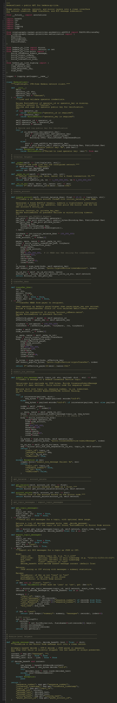
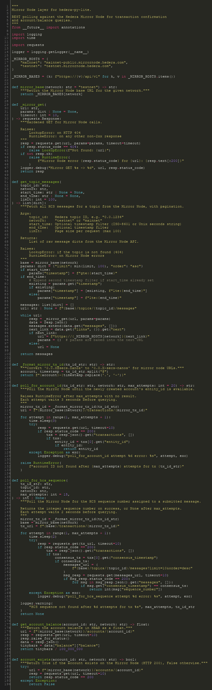
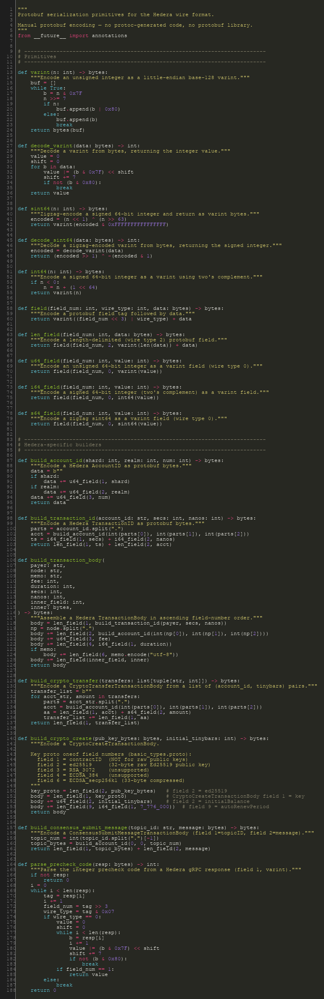
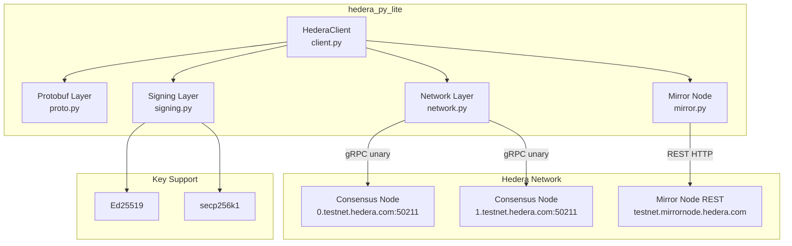
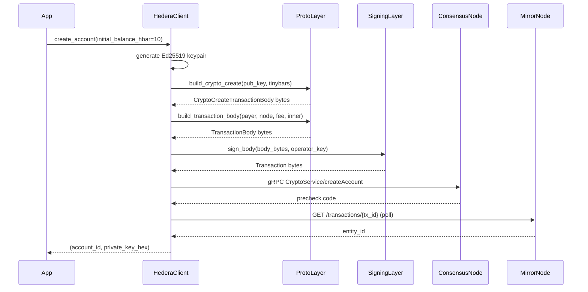
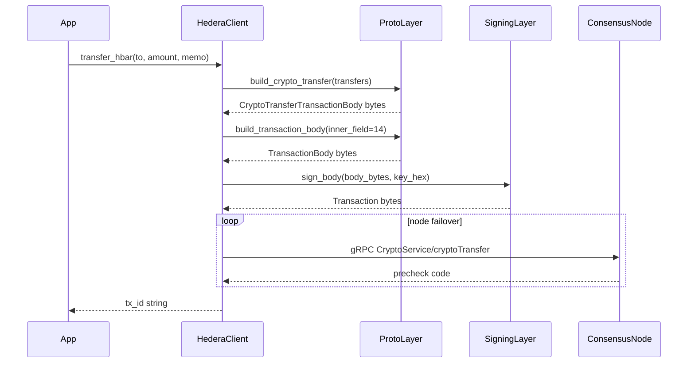
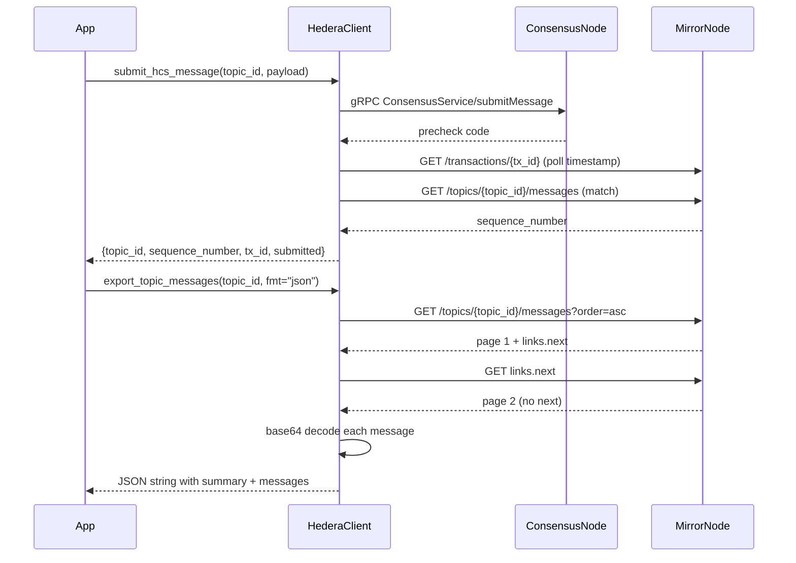

# hedera-py-lite

A lightweight, JVM-free Python client for the [Hedera](https://hedera.com) network.

No `hedera-sdk-py`. No JVM. No hashio relay. Just pure Python — built for serverless environments where cold-start latency and memory footprint matter.

[](https://pypi.org/project/hedera-py-lite/)
[](https://pypi.org/project/hedera-py-lite/)
[](LICENSE)
[](https://github.com/De-real-iManuel/hedera-py-lite/actions/workflows/ci.yml)

---

## Why hedera-py-lite?

The official Hedera SDK for Python requires a JVM under the hood — a non-starter for AWS Lambda, Vercel, Railway, and similar platforms. `hedera-py-lite` communicates directly with Hedera consensus nodes via gRPC and manually constructs protobuf transaction bodies — no JVM, no generated protobuf code, no heavy dependencies.

**Runtime dependencies:** `grpcio`, `cryptography`, `requests` — that's it.

---

## Features

- Account creation with Ed25519 keypair generation
- HBAR transfers (operator-signed or custom payer)
- HCS message submission with Mirror Node sequence number confirmation
- HCS topic export — all messages as **JSON or CSV** with auto base64 decoding and summary stats
- Mirror Node queries — balance, account existence, transaction confirmation
- Ed25519 and secp256k1 key support (DER and raw hex)
- Testnet and Mainnet support
- Property-based test suite via [Hypothesis](https://hypothesis.readthedocs.io/)

---

## Installation

```bash
pip install hedera-py-lite
```

Requires Python 3.11+.

---

## Quickstart

### 1. Set up credentials

Copy `.env.example` to `.env` and fill in your operator credentials:

```env
HEDERA_OPERATOR_ID=0.0.12345
HEDERA_OPERATOR_KEY=302e020100300506032b657004220420...
HEDERA_NETWORK=testnet
HEDERA_KEY_TYPE=ed25519
```

Get free testnet credentials from the [Hedera Developer Portal](https://portal.hedera.com/).

### 2. Initialize the client

```python
from hedera_py_lite import HederaClient

client = HederaClient(
    operator_id="0.0.12345",
    operator_key="302e020100300506032b657004220420...",
    network="testnet",  # or "mainnet"
)
```

### 3. Create an account

```python
account_id, private_key_hex = client.create_account(initial_balance_hbar=10.0)
print(f"New account: {account_id}")
# store private_key_hex securely — never log or commit it
```

### 4. Transfer HBAR

```python
tx_id = client.transfer_hbar(
    to="0.0.98",
    amount=1.0,
    memo="hello from hedera-py-lite",
)
print(f"Transaction ID: {tx_id}")
```

### 5. Submit an HCS message

```python
result = client.submit_hcs_message(
    topic_id="0.0.1234",
    payload={"event": "ping", "source": "my-app"},
)
print(f"Sequence number: {result['sequence_number']}")
```

### 6. Export HCS topic messages

```python
# JSON export — includes summary stats and auto-decoded message content
json_output = client.export_topic_messages("0.0.1234", fmt="json")
with open("messages.json", "w") as f:
    f.write(json_output)

# CSV export
csv_output = client.export_topic_messages("0.0.1234", fmt="csv")
with open("messages.csv", "w", newline="") as f:
    f.write(csv_output)

# With optional date range
json_output = client.export_topic_messages(
    "0.0.1234",
    start_time="2024-01-01T00:00:00Z",
    end_time="2024-12-31T23:59:59Z",
    fmt="json",
)
```

### 7. Query account balance

```python
balance = client.get_balance("0.0.12345")
print(f"Balance: {balance} HBAR")
```

---

## Export Output Examples

The files below were exported from a real Hedera Testnet topic (`0.0.8052389`) using `export_topic_messages()`:

- [`examples/output/topic_messages.json`](examples/output/topic_messages.json)
- [`examples/output/topic_messages.csv`](examples/output/topic_messages.csv)

**JSON structure:**

```json
{
  "summary": {
    "topic_id": "0.0.8052389",
    "total_messages": 13,
    "first_sequence": 1,
    "last_sequence": 13,
    "start_time": null,
    "end_time": null
  },
  "messages": [
    {
      "sequence_number": 1,
      "consensus_timestamp": "1772273648.702887000",
      "topic_id": "0.0.8052389",
      "message_b64": "eyJ0eXBlIjogIlRFU1Qi...",
      "message_text": "{\"type\": \"TEST\", \"message\": \"HCS logging test from Hedera Flow\"}",
      "message_json": {
        "type": "TEST",
        "message": "HCS logging test from Hedera Flow",
        "test_id": "test-001"
      },
      "running_hash": "MBV11NCgjylsBI38Gf...",
      "payer_account_id": "0.0.7942957"
    }
  ]
}
```

**CSV structure:**

```
sequence_number,consensus_timestamp,topic_id,message_b64,message_text,message_json,running_hash,payer_account_id
1,1772273648.702887000,0.0.8052389,eyJ0eXBlIjog...,"{""type"": ""TEST"", ...}","{...}",MBV11N...,0.0.7942957
```

---

## Code Snapshots

The library is intentionally small. Here's what the current source looks like:

**`client.py`** — public API: `HederaClient`, all transaction methods, and `export_topic_messages`



**`mirror.py`** — Mirror Node REST layer: polling, pagination, `get_topic_messages`, `_mirror_get`



**`proto.py`** — manual protobuf serialization primitives, no generated code



---

## Architecture



---

## Sequence Diagrams

### Account Creation



### HBAR Transfer



### HCS Submit + Export



---

## API Reference

### `HederaClient(operator_id, operator_key, network="testnet")`

| Parameter | Type | Description |
|---|---|---|
| `operator_id` | `str` | Hedera account ID, e.g. `"0.0.12345"` |
| `operator_key` | `str` | Private key — DER hex or raw 32-byte hex |
| `network` | `str` | `"testnet"` (default) or `"mainnet"` |

Raises `RuntimeError` if credentials are missing or the key cannot be loaded.

---

### `create_account(initial_balance_hbar=10.0) → tuple[str, str]`

Creates a new Hedera account funded from the operator. Returns `(account_id, private_key_hex)`.

---

### `transfer_hbar(to, amount, memo="", payer=None, payer_key=None) → str`

Transfers HBAR. Uses the operator as payer by default. Returns the transaction ID string.

---

### `submit_hcs_message(topic_id, payload) → dict`

Submits a message to an HCS topic. `payload` can be a `dict` (serialized as JSON) or a `str`.

Returns `{"topic_id", "sequence_number", "tx_id", "submitted"}`.

---

### `export_topic_messages(topic_id, start_time=None, end_time=None, fmt="json", decode_base64=True) → str`

Exports all HCS messages for a topic as a JSON or CSV string, with pagination, auto-decoding, and summary statistics.

| Parameter | Type | Description |
|---|---|---|
| `topic_id` | `str` | Hedera topic ID, e.g. `"0.0.1234"` |
| `start_time` | `str \| None` | Optional ISO-8601 or Unix timestamp filter |
| `end_time` | `str \| None` | Optional ISO-8601 or Unix timestamp filter |
| `fmt` | `str` | `"json"` (default) or `"csv"` |
| `decode_base64` | `bool` | Auto-decode message content (default `True`) |

Raises `ValueError` for invalid `fmt`, `LookupError` if topic not found, `RuntimeError` on Mirror Node errors.

---

### `get_topic_messages(topic_id, start_time=None, end_time=None) → list[dict]`

Fetches and decodes all HCS messages for a topic. Returns a list of decoded message dicts.

---

### `get_balance(account_id) → float`

Returns the account balance in HBAR.

---

### `account_exists(account_id) → bool`

Returns `True` if the account exists on the Mirror Node.

---

## Key Formats

| Format | Example prefix | Detection |
|---|---|---|
| Ed25519 DER | `302e...` | Auto-detected |
| secp256k1 DER | `3030...` / `3031...` | Auto-detected |
| Raw 32-byte hex | `a1b2c3...` (64 chars) | Defaults to Ed25519; set `HEDERA_KEY_TYPE=secp256k1` to override |

---

## Examples

```bash
python examples/create_account.py
python examples/send_hbar.py
python examples/submit_hcs_message.py
python examples/export_topic_messages.py
```

Sample output from a real testnet topic: [`examples/output/`](examples/output/)

---

## Project Structure

```
src/hedera_py_lite/
├── __init__.py     # exports HederaClient
├── client.py       # HederaClient — all public methods
├── proto.py        # manual protobuf serialization
├── signing.py      # key loading and transaction signing
├── network.py      # gRPC submission with node failover
└── mirror.py       # Mirror Node REST polling and topic export
tests/
├── test_proto.py
├── test_signing.py
├── test_mirror.py
├── test_network.py
└── test_export_topic_messages.py
examples/
├── create_account.py
├── send_hbar.py
├── submit_hcs_message.py
├── export_topic_messages.py
└── output/
    ├── topic_messages.json
    └── topic_messages.csv
```

---

## Limitations & Trade-offs

- **Manual protobuf serialization** — no generated code, no protobuf library. Fast and minimal, but requires manual updates for new Hedera transaction types.
- **Single maintainer** — new HIPs and transaction types are implemented manually.
- **No formal security audit** — aggressive property-based tests are included, but the custom serializer has not been externally audited.
- **Best suited for** DePIN/IoT devices, Web2.5 custodial wallets, HCS logging/auditing, and serverless backends. For full-featured applications, consider `hiero-sdk-python`.

---

## Development

```bash
git clone https://github.com/De-real-iManuel/hedera-py-lite.git
cd hedera-py-lite
pip install -e ".[dev]"
cp .env.example .env
pytest
```

---

## Contributing

See [CONTRIBUTING.md](CONTRIBUTING.md).

---

## Security

Never commit private keys. See [SECURITY.md](SECURITY.md) for the vulnerability reporting process.

---

## License

MIT — see [LICENSE](LICENSE).

---

## Author

**Emmanuel Okechukwu Nwajari** (De real iManuel)
