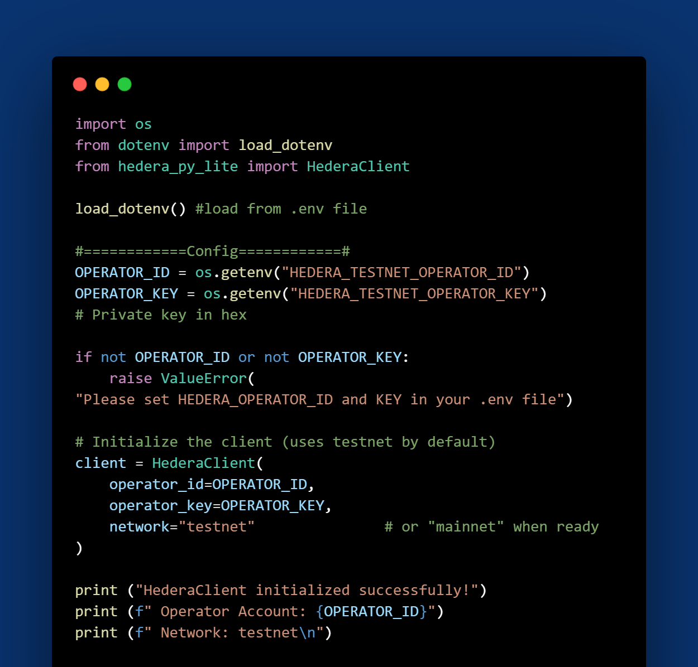
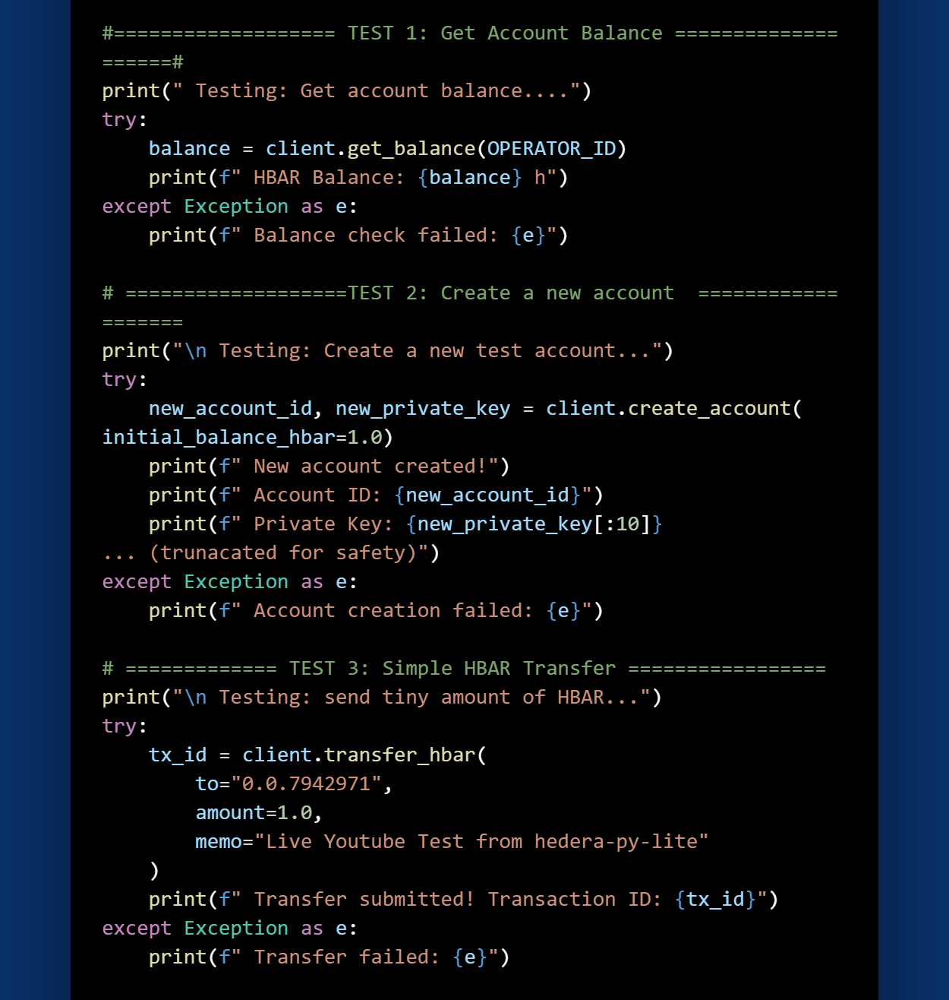
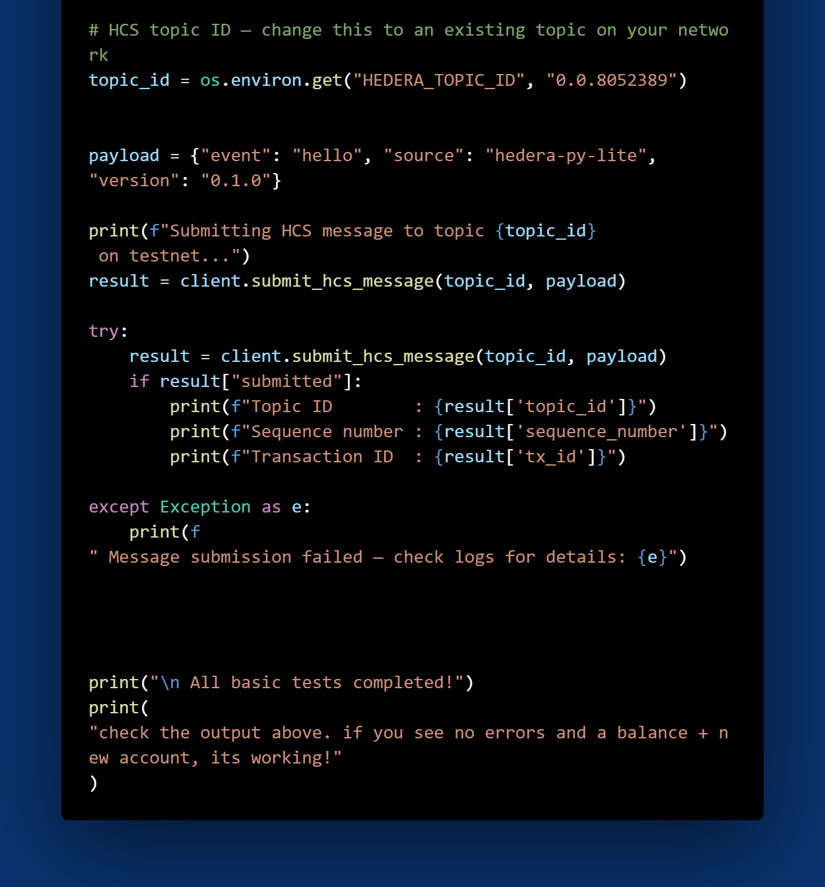
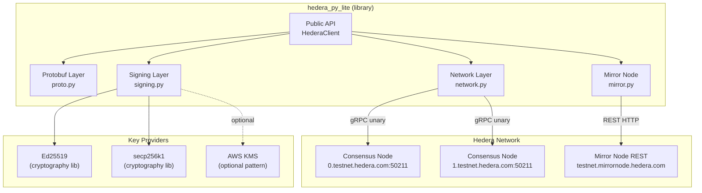
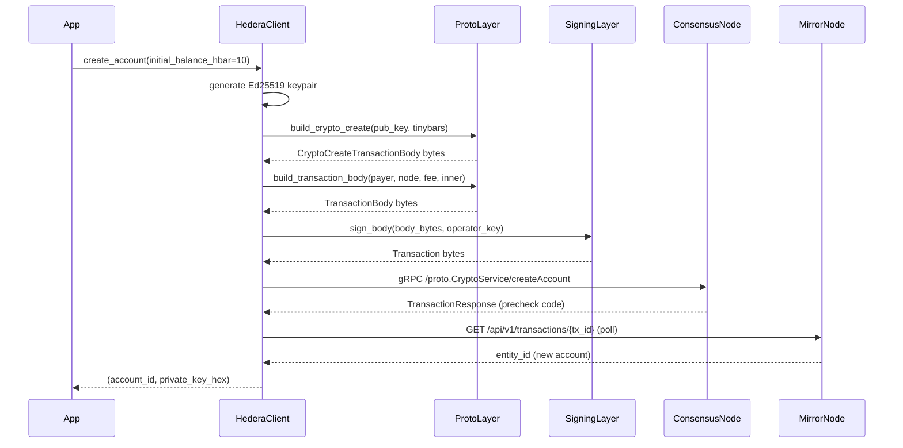
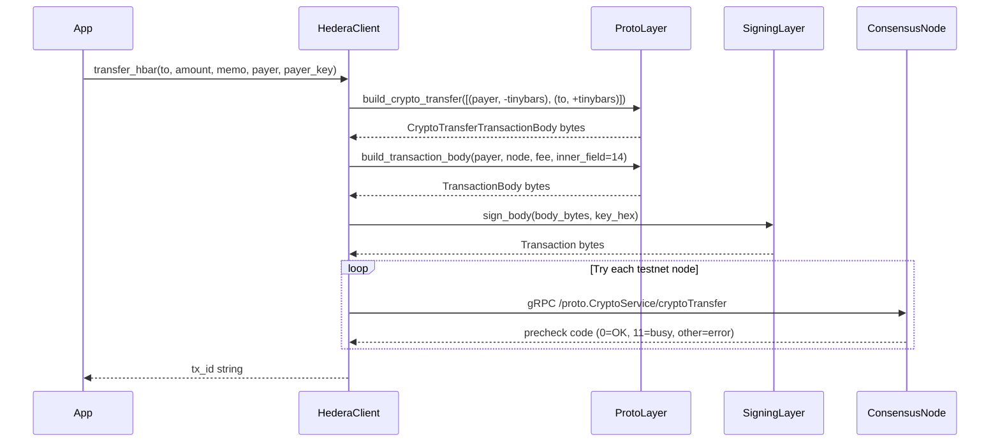
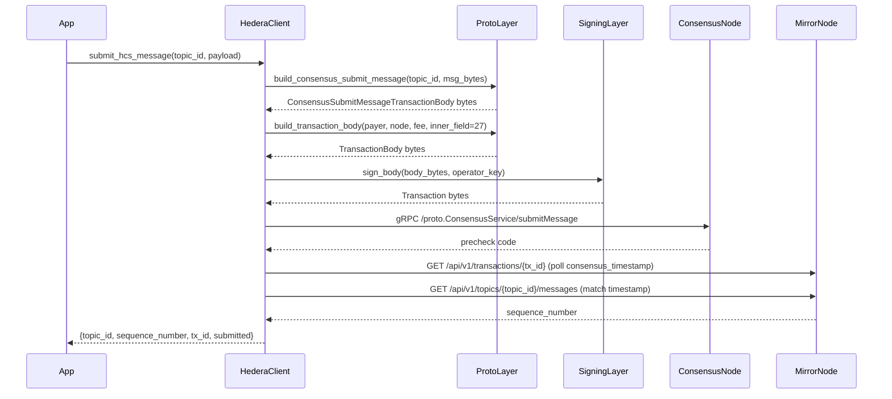

# hedera-py-lite

A lightweight, JVM-free Python client for the [Hedera](https://hedera.com) network.

No `hedera-sdk-py`. No JVM. No hashio relay. Just pure Python — built for serverless environments where cold-start latency and memory footprint matter.

[](https://pypi.org/project/hedera-py-lite/)
[](https://pypi.org/project/hedera-py-lite/)
[](LICENSE)
[](https://github.com/De-real-iManuel/hedera-py-lite/actions/workflows/ci.yml)

---

## Code Snapshot

The library is intentionally small. Here's what the full source looks like:


*Top of the file: imports, constants, and the `HederaClient.__init__` constructor with credential loading and key detection.*


*Core transaction methods: `create_account`, `transfer_hbar`, and `submit_hcs_message` — each delegating to the proto, signing, and network layers.*


*Mirror node helpers: `get_balance` and `account_exists`, plus the module-level `__all__` export.*

---

## Architecture



---

## Sequence Diagrams

### Account Creation



### HBAR Transfer



### HCS Message Submission



---

## Why hedera-py-lite?

The official Hedera SDK for Python requires a JVM under the hood. That's a non-starter for AWS Lambda, Vercel, Railway, and similar platforms. `hedera-py-lite` communicates directly with Hedera consensus nodes via gRPC and manually constructs protobuf transaction bodies — no JVM, no generated protobuf code, no heavy dependencies.

**Dependencies:** `grpcio`, `cryptography`, `requests` — that's it.

---

## Features

- Account creation with Ed25519 keypair generation
- HBAR transfers (operator-signed or custom payer)
- HCS (Hedera Consensus Service) message submission
- Mirror Node queries — balance, account existence, transaction confirmation
- Ed25519 and secp256k1 key support (DER and raw hex)
- Testnet and Mainnet support
- Property-based test suite via [Hypothesis](https://hypothesis.readthedocs.io/)

---

## Limitations & Trade-offs

`hedera-py-lite` is deliberately **minimal and hand-rolled** for maximum lightness in serverless environments:

- **Manual protobuf serialization** instead of using Hedera’s official generated code (`hedera-protobufs`).  
  → Extremely small and fast, but requires manual updates whenever Hedera adds new fields or transaction types.

- **Maintenance** is currently handled by a single maintainer.  
  → New Hedera features (HIPs, new transaction types, etc.) will need to be implemented manually.

- **Security surface** of the custom serializer is higher than the battle-tested `google.protobuf` library used by `hiero-sdk-python`.  
  → The library includes aggressive property-based tests, but it has not yet received a formal security audit.

- **Best suited for** simple transaction flows, DePIN/IoT devices, Web2.5 custodial wallets, and serverless backends.  
  For full-featured applications, consider the official `hiero-sdk-python` or `hedera-agent-kit`.

This library was built to solve the exact JVM/serverless pain I faced while building **Hedera Flow**. It is production-ready for its intended scope, but please review the code and test thoroughly for your use case.

---
## Installation

```bash
pip install hedera-py-lite
```

Requires Python 3.11+.

---

## Quickstart

### 1. Set up credentials

Copy `.env.example` to `.env` and fill in your operator credentials:

```env
HEDERA_OPERATOR_ID=0.0.12345
HEDERA_OPERATOR_KEY=302e020100300506032b657004220420...
HEDERA_NETWORK=testnet
HEDERA_KEY_TYPE=ed25519
```

You can get free testnet credentials from the [Hedera Developer Portal](https://portal.hedera.com/).

### 2. Initialize the client

```python
from hedera_py_lite import HederaClient

client = HederaClient(
    operator_id="0.0.12345",
    operator_key="302e020100300506032b657004220420...",
    network="testnet",  # or "mainnet"
)
```

### 3. Create an account

```python
account_id, private_key_hex = client.create_account(initial_balance_hbar=10.0)
print(f"New account: {account_id}")
print(f"Private key: {private_key_hex}")  # store this securely
```

### 4. Transfer HBAR

```python
tx_id = client.transfer_hbar(
    to="0.0.98",
    amount=1.0,
    memo="hello from hedera-py-lite",
)
print(f"Transaction ID: {tx_id}")
```

### 5. Submit an HCS message

```python
result = client.submit_hcs_message(
    topic_id="0.0.1234",
    payload={"event": "ping", "source": "my-app"},
)
print(f"Sequence number: {result['sequence_number']}")
```

### 6. Query account balance

```python
balance = client.get_balance("0.0.12345")
print(f"Balance: {balance} HBAR")
```

---

## API Reference

### `HederaClient(operator_id, operator_key, network="testnet")`

| Parameter | Type | Description |
|---|---|---|
| `operator_id` | `str` | Hedera account ID (e.g. `"0.0.12345"`) |
| `operator_key` | `str` | Private key — DER hex or raw 32-byte hex |
| `network` | `str` | `"testnet"` (default) or `"mainnet"` |

Raises `RuntimeError` if credentials are missing or the key cannot be loaded.

---

### `create_account(initial_balance_hbar=10.0) → tuple[str, str]`

Creates a new Hedera account funded from the operator. Returns `(account_id, private_key_hex)`.

---

### `transfer_hbar(to, amount, memo="", payer=None, payer_key=None) → str`

Transfers HBAR. Uses the operator as payer by default. Returns the transaction ID string.

| Parameter | Type | Description |
|---|---|---|
| `to` | `str` | Recipient account ID |
| `amount` | `float` | Amount in HBAR |
| `memo` | `str` | Optional memo (max 100 chars) |
| `payer` | `str \| None` | Custom payer account ID |
| `payer_key` | `str \| None` | Custom payer private key hex |

---

### `submit_hcs_message(topic_id, payload) → dict`

Submits a message to an HCS topic. `payload` can be a `dict` (serialized as JSON) or a `str`.

Returns:
```python
{
    "topic_id": "0.0.1234",
    "sequence_number": 42,       # None if polling timed out
    "tx_id": "0.0.12345@...",
    "submitted": True,           # False on any failure
}
```

Never raises — returns `submitted: False` on failure.

---

### `get_balance(account_id) → float`

Returns the account balance in HBAR.

---

### `account_exists(account_id) → bool`

Returns `True` if the account exists on the Mirror Node.

---

## Key Formats

Both Ed25519 and secp256k1 keys are supported in DER (PKCS#8) or raw 32-byte hex format.

| Format | Example prefix | Detection |
|---|---|---|
| Ed25519 DER | `302e...` | Auto-detected |
| secp256k1 DER | `3030...` / `3031...` | Auto-detected |
| Raw 32-byte hex | `a1b2c3...` (64 chars) | Defaults to Ed25519; set `HEDERA_KEY_TYPE=secp256k1` to override |

---

## Examples

Runnable examples are in the [`examples/`](examples/) directory:

```bash
python examples/create_account.py
python examples/send_hbar.py
python examples/submit_hcs_message.py
```

---

## Development

### Setup

```bash
git clone https://github.com/De-real-iManuel/hedera-py-lite.git
cd hedera-py-lite
pip install -e ".[dev]"
```

### Running tests

```bash
pytest
```

The test suite uses [Hypothesis](https://hypothesis.readthedocs.io/) for property-based testing across the protobuf, signing, and mirror layers.

### Project structure

```
src/hedera_py_lite/
├── __init__.py     # Public API — exports HederaClient
├── client.py       # HederaClient — top-level user-facing class
├── proto.py        # Manual protobuf serialization primitives
├── signing.py      # Key loading, algorithm detection, transaction signing
├── network.py      # gRPC submission with node failover
└── mirror.py       # Mirror Node REST polling
tests/
├── test_proto.py
├── test_signing.py
└── test_mirror.py
examples/
├── create_account.py
├── send_hbar.py
└── submit_hcs_message.py
```

---

## Contributing

Contributions are welcome. Please read [CONTRIBUTING.md](CONTRIBUTING.md) before opening a PR.

---

## Security

If you discover a security vulnerability, please follow the process in [SECURITY.md](SECURITY.md). Do not open a public issue.

---

## License

MIT — see [LICENSE](LICENSE).

---

## Author

**Emmanuel Okechukwu Nwajari** (De real iManuel)
